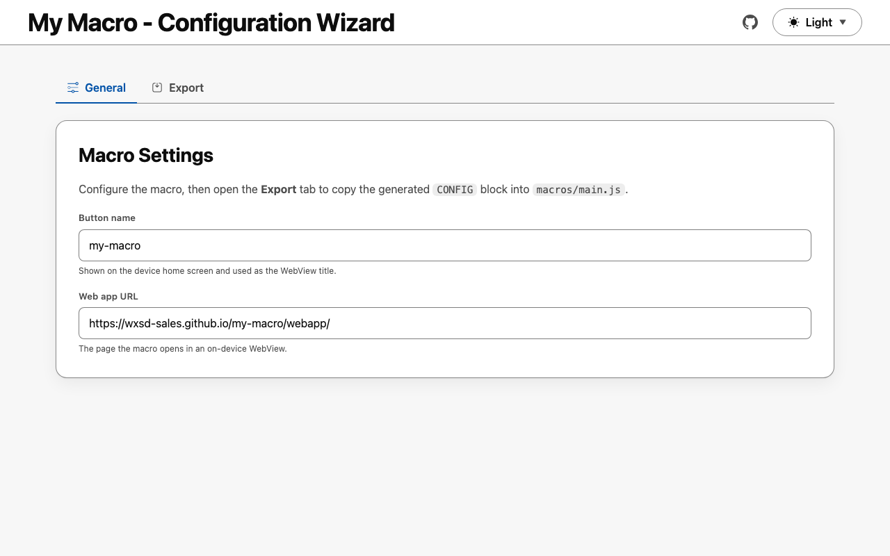
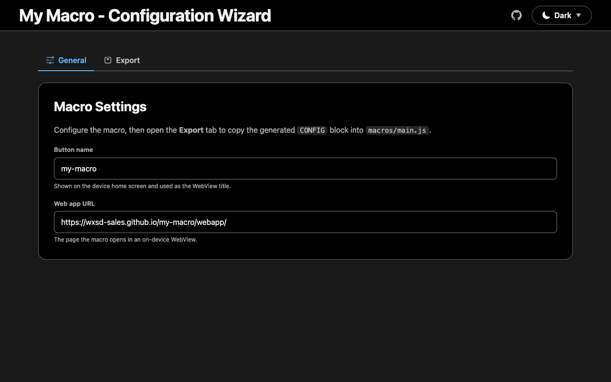
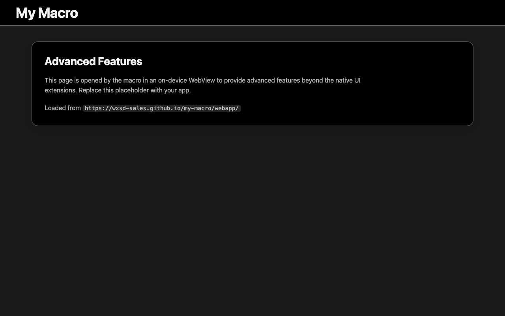

<!-- title:start -->

# My Macro

<!-- title:end -->

<!-- description:start -->

One sentence description of what this macro does.
<!-- description:end -->

A template for Cisco RoomOS (Webex) collaboration macros, paired with two static
web apps published to GitHub Pages: a configuration **wizard** and an optional
**web app** the macro can open in an on-device WebView for advanced features.

> The title, description, and URLs above are generated from
> `project.config.json`. Run `npm run setup` to customise them.

## Live URLs

<!-- urls:start -->

- Wizard: https://wxsd-sales.github.io/my-macro/wizard/
- Web app: https://wxsd-sales.github.io/my-macro/webapp/

<!-- urls:end -->

## Quick start

```sh
npm install
npm run setup   # names the project and rewrites the derived values
npm test
```

`npm run setup` prompts for the project name, title, description, author, and
GitHub org/repo (auto-detected from your git remote), writes
`project.config.json`, then propagates those values into `package.json`, the
macro, and both web apps. Re-run it any time; it is idempotent.

## Project structure

```text
.
├── __tests__/        # Jest tests (macros use jest-mock-xapi)
├── .github/workflows # CI: test, deploy Pages, refresh screenshots
├── assets/           # README screenshots (generated)
├── macros/           # single-file RoomOS macros
├── scripts/          # dev automation (setup, apply-config, serve, screenshots, deploy-macro)
├── webapp/           # optional advanced-feature app (Pages: /webapp/)
├── wizard/           # macro configuration app (Pages: /wizard/)
│                     #   app-config.js is generated from project.config.json
├── project.config.json         # single source of truth (see .schema.json)
└── project.config.schema.json  # JSON Schema for project.config.json
```

## Installing the macro

1. Open the device web interface: **Customization > Macro Editor**.
2. Create a new macro and paste the contents of [`macros/main.js`](macros/main.js).
3. Save and enable the macro.

The `CONFIG` block in the macro is managed by `npm run apply-config`; use the
[wizard](#live-urls) to generate an updated block (**Copy config**) or download a
ready-to-import macro file (**Download macro**) after changing settings.

### Deploy to a device over xAPI

`npm run deploy:macro` uploads a macro straight to a device using
[`jsxapi`](https://github.com/cisco-ce/jsxapi). Provide credentials via
environment variables (never commit them):

```sh
DEVICE_HOST=192.0.2.10 DEVICE_USERNAME=admin DEVICE_PASSWORD=... \
  npm run deploy:macro
```

Set `MACRO_FILE` to deploy a macro other than `macros/main.js`, and
`MACRO_ACTIVATE=false` to upload without enabling it.

## Dev scripts

| Command                | Description                                                      |
| ---------------------- | ---------------------------------------------------------------- |
| `npm run setup`        | Interactive rename; writes `project.config.json` and applies it  |
| `npm run apply-config` | Re-apply `project.config.json` to all files                      |
| `npm run serve`        | Serve the repo locally (wizard + webapp) with Node's http server |
| `npm run screenshots`  | Capture `assets/*-light.png` / `*-dark.png` via headless Chrome  |
| `npm run deploy:macro` | Upload a macro to a device over xAPI (see below)                 |
| `npm run lint`         | Lint with ESLint                                                 |
| `npm run format`       | Format with Prettier (`npm run format:check` to verify)          |
| `npm test`             | Run the Jest suite                                               |

Screenshots use a headless Chrome/Chromium already installed on your machine.
Set `CHROME_BIN` to override binary detection.

<!-- Screenshots are regenerated by .github/workflows/screenshots.yml -->

|         | Light                                       | Dark                                      |
| ------- | ------------------------------------------- | ----------------------------------------- |
| Wizard  |   |   |
| Web app |  |  |

## Deployment

Pushing to `main` triggers `deploy-pages.yml`, which publishes `wizard/` and
`webapp/` to GitHub Pages. Enable Pages with the **GitHub Actions** source in
your repository settings (Settings > Pages).

## License

All contents are licensed under the MIT license. Please see [license](LICENSE) for details.

## Disclaimer

Everything included is for demo and Proof of Concept purposes only. Use of the site is solely at your own risk. This site may contain links to third party content, which we do not warrant, endorse, or assume liability for. These demos are for Cisco Webex use cases, but are not Official Cisco Webex Branded demos.

## Questions

Please contact the WXSD team at [wxsd@external.cisco.com](mailto:wxsd@external.cisco.com?subject=my-macro) for questions. Or, if you're a Cisco internal employee, reach out to us on the Webex App via our bot (globalexpert@webex.bot). In the "Engagement Type" field, choose the "API/SDK Proof of Concept Integration Development" option to make sure you reach our team.
