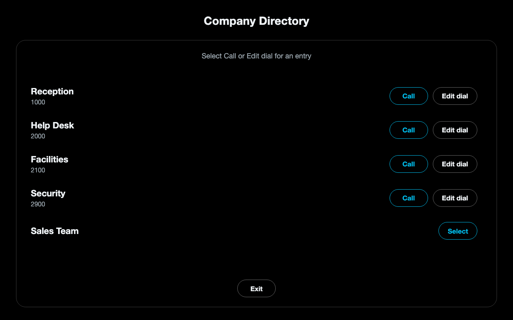
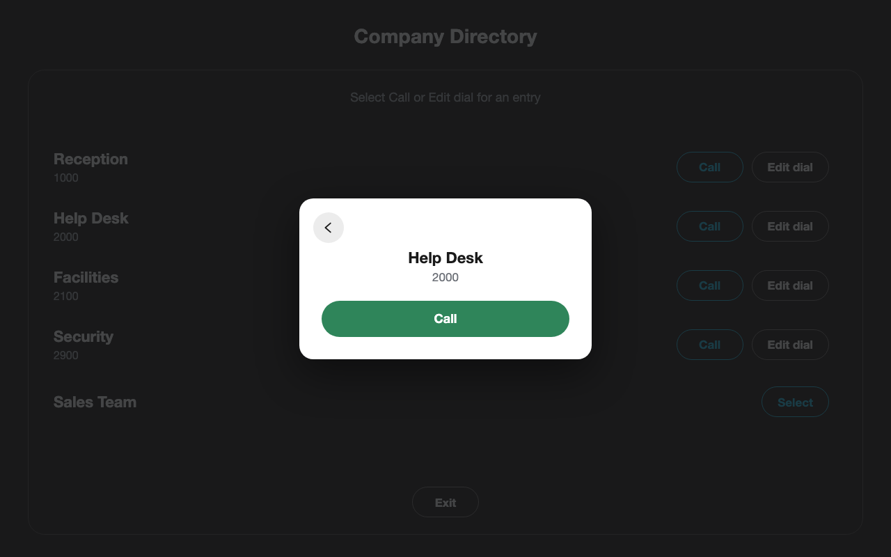
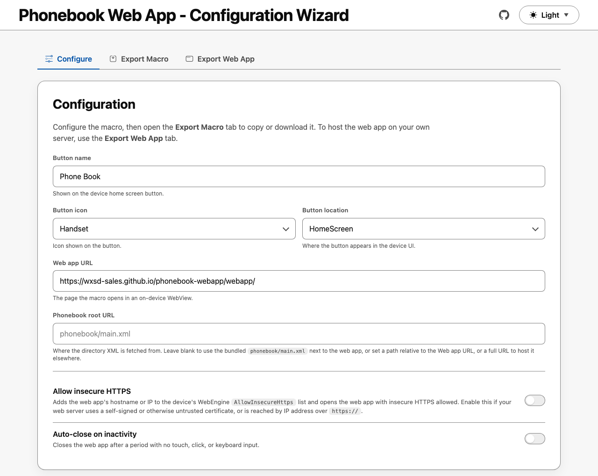
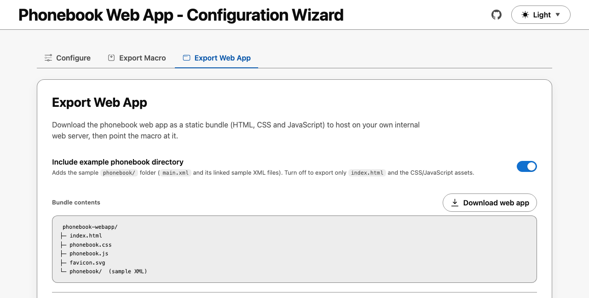
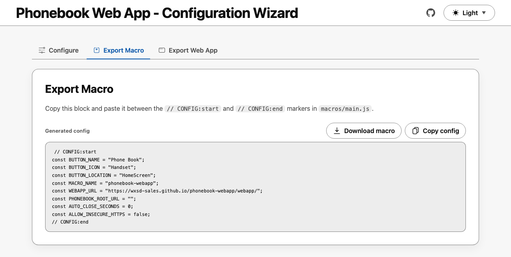

# Phonebook Web App

A Cisco RoomOS macro and companion web app that let you open a web-based custom phonebook on your device's OSD or Controller, with click-to-call and edit-before-dial support.

<p align="center">
  
</p>

## Overview

### Open Phonebook Web App From Anywhere

This project leverages a macro that saves a custom phonebook button on the home screen of a device's interactive OSD and Controller. Tapping it opens the phonebook web app on that interface, giving you "Web App" like functionality on your Room Navigators.

```mermaid
flowchart LR

    %% Actor & Initial Interaction
    User(["👤 User"]) -->|"Taps UI Extension"| Button

    %% RoomOS Device Boundary
    subgraph RoomOS["RoomOS Device"]
        direction TB

        Button["UI Extension Button<br/><i>'Phone Book'</i>"]
        Macro@{ shape: console, label: "RoomOS Macro" }
        WebApp@{ shape: div-rect, label: "WebView<br/>(Phone Book App)" }
        Call(["Call Placed<br/><i>xCommand Dial</i>"])

        %% Internal Device Event Flow
        Button -->|"xFeedback: PanelClicked"| Macro
        Macro -->|"1: xCommand UserInterface<br/>WebView Display"| WebApp
        WebApp -->|"3: URL Hash / Event<br/>(Dial Target Selected)"| Macro
        Macro -->|"4: Initiates call"| Call
        Macro -.->|"5: xCommand UserInterface<br/>WebView Clear"| WebApp
    end

    %% External Web Server Infrastructure
    subgraph WebServer["External Web Server"]
        direction TB
        AppFiles["Phone Book Web App<br/>(HTML / JS / CSS)"]
        XML[("Directory XML<br/>(Phone Book Source)")]
    end

    %% Web Traffic / Asset Retrieval
    WebApp -->|"2: Loads Web App"| AppFiles
    WebApp <-->|"Fetches contacts"| XML
```

### Dial From Anywhere

This project lets users click-to-call via the opened phonebook web app from any interface (OSD, Controller, etc.). This is accomplished by having the web app update the WebView's URL hash parameters (e.g. `#command=dial&number=2000`) when a user taps the call button. The companion macro included with this project monitors changes to the WebView URL, and when it detects a `dial` command in the URL, it dials the number specified in the `number` parameter using the `xapi.Command.Dial` xCommand.

This approach works around the issue where the native Click to Call solution on RoomOS, which uses the SIP protocol handler (e.g. `sip://1234`), isn't supported in WebViews opened on the Controller interface.

<p align="center">
  
</p>

Example URL Hash Parameters:

```text
https://phonebook.example.com/#command=dial&number=2000
```

### Edit Number Before You Dial

This web app lets a user edit a phonebook number before dialing. Tapping the **Edit dial** button opens an edit-number modal, and when ready, the user taps the Call button below the edit field to place the call.

<p align="center">
  
</p>

### Easy Configuration Using Wizard

The project includes a web-based configuration wizard to help you configure the macro. The wizard lets you copy/paste the macro's config or download a copy of the macro with the configuration already set. It also lets you export the phonebook web app itself as a zip, so you can host it on your own internal web server (see [Host The Web App Yourself](#host-the-web-app-yourself)).

- **Button** - display name, icon, and where it appears (home screen, call
  controls, etc.).
- **Web App URL** - where the macro opens the web app from.
- **Phonebook Root URL** - where the web app fetches its directory XML from.
  Leave it blank to use the web app's bundled `phonebook/main.xml`, or set a
  path relative to the web app or a full URL to host it elsewhere.
- **Allow Insecure HTTPS** - for web servers with a self-signed certificate or
  reached by IP address over HTTPS (see
  [Host The Web App Yourself](#host-the-web-app-yourself)).
- **Auto-Close On Inactivity** - optionally close the web view after a period
  with no user interaction.

  <a href="https://wxsd-sales.github.io/phonebook-webapp/wizard/#tab=configure">
    <picture>
      <source media="(prefers-color-scheme: dark)" srcset="assets/wizard-dark.png">
      <source media="(prefers-color-scheme: light)" srcset="assets/wizard-light.png">
      
    </picture>
  </a>

### Host The Web App Yourself

The wizard's [**Export Web App**](https://wxsd-sales.github.io/phonebook-webapp/wizard/#tab=webapp) tab lets you download a copy of the phonebook web app as a static bundle (`index.html`, CSS and JavaScript) in a `phonebook-webapp.zip`. An admin can unzip it onto an internal web server, then set the macro's **Web app URL** to the FQDN and path of that copy (e.g. `https://phonebook.example.com/phonebook/`) and export the macro as usual. No server-side code is required, just HTTPS and a static file host reachable by your devices.

If your internal web server has no trusted certificate (for example it is reached by IP address, or uses a self-signed certificate), enable **Allow insecure HTTPS** on the wizard's Configure tab. The macro then adds the web app's hostname or IP to the device's WebEngine allow list (`xapi.Command.WebEngine.AllowInsecureHttps.Add`) and opens the web app with `AllowInsecureHttps` set. If the Web app URL is an `https://` address using an IP and this option is off, the macro shows an on-screen alert when it starts and does not run until the config is fixed.

A toggle controls whether the example phonebook directory (`phonebook/main.xml` and its linked sample XML files) is included. Turn it off to export only the raw web app assets, then host your own directory XML and set **Phonebook root URL** to it.

<p align="center">
  <a href="https://wxsd-sales.github.io/phonebook-webapp/wizard/#tab=webapp">
    <picture>
      <source media="(prefers-color-scheme: dark)" srcset="assets/wizard-webapp-export-dark.png">
      <source media="(prefers-color-scheme: light)" srcset="assets/wizard-webapp-export-light.png">
      
    </picture>
  </a>
</p>

## Demo

View the GitHub-hosted instance of the phonebook web app here: https://wxsd-sales.github.io/phonebook-webapp/webapp/

Try out this solution on a real Cisco RoomOS device by downloading a copy of the macro with its default config from the wizard's [Export Macro](https://wxsd-sales.github.io/phonebook-webapp/wizard/#tab=macro) tab. With the default settings the macro opens the GitHub Pages hosted demo phonebook web app and its sample phonebook XML, so the device only needs internet access to reach `wxsd-sales.github.io`.

<p align="center">
  <a href="https://wxsd-sales.github.io/phonebook-webapp/wizard/#tab=macro">
    <picture>
      <source media="(prefers-color-scheme: dark)" srcset="assets/wizard-macro-export-dark.png">
      <source media="(prefers-color-scheme: light)" srcset="assets/wizard-macro-export-light.png">
      
    </picture>
  </a>
</p>

## License

All contents are licensed under the MIT license. Please see [license](LICENSE) for details.

## Disclaimer

Everything included is for demo and Proof of Concept purposes only. Use of the site is solely at your own risk. This site may contain links to third party content, which we do not warrant, endorse, or assume liability for. These demos are for Cisco Webex use cases, but are not Official Cisco Webex Branded demos.

## Questions

Please contact the WXSD team at [wxsd@external.cisco.com](mailto:wxsd@external.cisco.com?subject=phonebook-webapp) for questions. Or, if you're a Cisco internal employee, reach out to us on the Webex App via our bot (globalexpert@webex.bot). In the "Engagement Type" field, choose the "API/SDK Proof of Concept Integration Development" option to make sure you reach our team.
